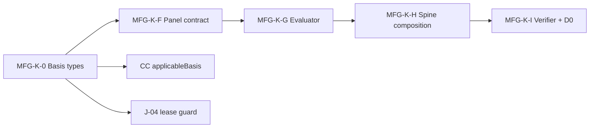

# Phase MFG-2 — Manufacturing Wave 2 Build Specification

**Spec authored:** 2026-06-22  
**Baseline commits:** `12ff209` (Wave 1 sources) → `e98c7a3` (MFG-1 recon report + Section J decisions)  
**Branch:** `architecture-lane-refactor-baseline`  
**Upstream authority:** [`docs/phase_mfg_1_recon_report.md`](phase_mfg_1_recon_report.md), [`docs/manufacturing/wave1/MANUFACTURING_VERTICAL_PLANNING_DOCUMENT.md`](manufacturing/wave1/MANUFACTURING_VERTICAL_PLANNING_DOCUMENT.md)

**DRAFT / SPEC ONLY — DO NOT EXECUTE BUILDS.** This document is the agent-written build spec required before Cursor implements MFG-K-0 through MFG-K-I. **Founder approval of this document is mandatory before any Wave 2 code is written.**

---

## 0. Mission

Wave 2 delivers the manufacturing knowledge stack **runtime layer**: reporting-basis types, panel contract, variance evaluator, spine composition binding, and verifier with D0 proof artifact — all **additive**, with **no Phase 42 file edits**.

**Wave 2 modules:** MFG-K-0 → MFG-K-F → MFG-K-G → MFG-K-H → MFG-K-I  
**Wave 3 (out of scope here):** MFG-K-J (D0 panel probe), MFG-K-K (founder lock)

---

## 1. Prerequisites (complete)

| Gate | Status |
|---|---|
| Wave 1 at `docs/manufacturing/wave1/` | Committed `12ff209` |
| MFG-1 recon | Committed `e98c7a3` |
| Section J founder decisions | Locked (Section 2) |
| MFG-2 plan + 6 amendments | Incorporated (Section 3) |
| Phase 42 lock | ALL CLEAR per recon Section B |

---

## 2. Section J — Founder decisions (locked)

| ID | Decision |
|---|---|
| **J-01 / Q1** | Defer entity schema to **Wave 3**. Wave 2 binds panel at **company level** with **`ManufacturingPanelContext` stub** (Amendment 3). No Supabase migration in Wave 2. |
| **J-02** | **Binary IFRS** at UI (`ReportingBasis`); internal default `ifrs_iasb` when user selects `IFRS`. Full `StandardsReportingFramework` enum unchanged for accounting. |
| **J-03** | **Sequence:** MFG-K-0 → F → G → H → I. |
| **J-04** | **Lease observation framework guard only** in Wave 2; remainder of audit layer deferred to Wave 3. Guard **must use `basisOf()`** (Amendment 4). |
| **J-05** | **Split paths:** shape-only contract at `lib/dashboard/panels/manufacturing-variance/`; evaluator at `lib/intelligence/synthetic/industry/manufacturing/variance/`. |
| **J-06** | **Spot-check** critical URLs in this spec (Section 8); **full** register enforcement at MFG-K-I. |

---

## 3. MFG-2 plan amendments (binding)

### Amendment 1 — D0 proof artifact at MFG-K-I

`scripts/verify-manufacturing-knowledge-stack.js` **must write** D0 evidence on **every run** (pass or fail):

**Path:** `ops/compliance/manufacturing-knowledge-stack/D0_MFG_KNOWLEDGE_STACK_EVIDENCE.json`

**Schema family** (matches existing `ops/compliance/**/D0_*EVIDENCE.json`):

```json
{
  "evidenceVersion": "MFG-K-I-1",
  "generatedAt": "<ISO-8601>",
  "totalCases": <number>,
  "passCount": <number>,
  "failCount": <number>,
  "cases": [
    {
      "id": "CHK-MFG-PC-01",
      "decision": "ALLOW | DENY",
      "expected": "ALLOW | DENY",
      "outcome": "PASS | FAIL",
      "reason": "<machine-readable slug>"
    }
  ]
}
```

**Hard rule:** Verifier exit code 0 **without** a freshly written D0 artifact is **not acceptable**. The verifier must create the output directory if missing and overwrite the JSON atomically on each invocation.

### Amendment 2 — Citation spot-check additions (J-06)

Section 8 documents fresh-fetch results for HIGH-priority register rows. If any HIGH-priority row has **materially changed** since the citation register was authored, this spec reflects current state (see Section 8.2).

### Amendment 3 — `ManufacturingPanelContext` concrete interface

Declared in `lib/intelligence/synthetic/industry/contracts/manufacturing/ManufacturingBasisContracts.ts` (Section 5.1). This interface is the **contract Wave 3 schema migration must preserve**. Inline documentation required.

### Amendment 4 — Lease guard must use `basisOf()`

`buildLeaseIntelligenceObservation.ts` branches **only** on `basisOf(reportingFramework) === 'US_GAAP' | 'IFRS'`. Direct comparison against `StandardsReportingFramework` literals (e.g. `reportingFramework === 'us_gaap'`) is **prohibited** at this layer so `ifrs_eu`, `ifrs_for_smes`, and `ifrs_iasb` route identically through the IFRS branch.

### Amendment 5 — PC floor for MFG-K-I

MFG-K-I produces **≥ 20** proof-case results in the **CHK-MFG** namespace. Specific PC IDs are enumerated in **Section 9.5** below. Enumeration is complete **before** MFG-K-I implementation begins.

### Amendment 6 — Recon report committed

Completed at `e98c7a3` with founder decision body in commit message.

---

## 4. Module sequence



| Module | Deliverable | Code? |
|---|---|---|
| MFG-K-0 | `ReportingBasis.ts`, `ManufacturingBasisContracts.ts`, CC `applicableBasis`, lease guard | Yes |
| MFG-K-F | `MFG_K_F_Panel_Field_Contract_Spec.md` + `contract.ts` | Spec then interfaces |
| MFG-K-G | `MFG_K_G_Variance_Evaluator_Spec.md` + pure functions | Spec then build |
| MFG-K-H | `MFG_K_H_Spine_Composition_Spec.md` + composition binding | Spec then build |
| MFG-K-I | `verify-manufacturing-knowledge-stack.js` + D0 JSON | Yes |

**Estimated commits:** 5–8 (one per module minimum; sub-specs may share commits with their builds).

---

## 5. MFG-K-0 — Reporting basis foundation

### 5.1 — `ReportingBasis.ts`

**Path:** `lib/intelligence/synthetic/standards/contracts/ReportingBasis.ts` (net-new)

```typescript
import type { StandardsReportingFramework } from "./StandardsContracts";

export type ReportingBasis = "US_GAAP" | "IFRS";

/** Maps full accounting enum to binary panel-router discriminator. */
export function basisOf(fw: StandardsReportingFramework): ReportingBasis {
  return fw === "us_gaap" ? "US_GAAP" : "IFRS";
}
```

**Additive export** from `lib/intelligence/synthetic/standards/contracts/index.ts`.

### 5.2 — `ManufacturingBasisContracts.ts`

**Path:** `lib/intelligence/synthetic/industry/contracts/manufacturing/ManufacturingBasisContracts.ts` (net-new)

**Amendment 3 — `ManufacturingPanelContext` (Wave 3 preservation contract):**

```typescript
import type { ReportingBasis } from "../../../standards/contracts/ReportingBasis";

/**
 * Panel read context for manufacturing variance surfaces.
 *
 * Wave 2: company-level binding only — entityId is always undefined;
 * naicsCode is optional/nullable until Wave 3 entity schema lands.
 *
 * Wave 3 migration MUST preserve this interface shape when adding
 * tenant→entity→NAICS persistence. Do not rename or remove fields.
 */
export interface ManufacturingPanelContext {
  companyId: string;
  entityId?: string; // Wave 3 hook; always undefined in Wave 2
  reportingBasis: ReportingBasis;
  subSegment: "D" | "P" | "H" | "J" | "E";
  naicsCode?: string; // Wave 3 hook; nullable in Wave 2
}
```

**Discriminated unions** (same file; per recon Section F):

- `USGAAPInventory` / `IFRSInventory` — LIFO + `lifoReserve` only on US_GAAP branch
- `USGAAPLease` / `IFRSLease` — operating/finance vs `ifrs16_single_model`
- `USGAAP_PPE` / `IFRS_PPE` — historical cost vs cost/revaluation + componentization
- `USGAAPRevenueContract` / `IFRSRevenueContract` — ASC 606 vs IFRS 15 tags
- `USGAAPDisclosurePackage` / `IFRSDisclosurePackage` — `lifoReserveDisclosureRequired: false` literal on IFRS

### 5.3 — Command Center `applicableBasis`

**Path:** `lib/intelligence/synthetic/command-center/surface-candidates/buildCommandCenterSurfaceCandidate.ts`

Additive field on input + candidate:

```typescript
applicableBasis: ReportingBasis[]; // default ['US_GAAP', 'IFRS'] for basis-agnostic surfaces
```

**Out of scope:** `panels/registry.ts`, `app/upload/page.tsx` `packageDefaultSections`.

### 5.4 — J-04 Lease audit guard (Wave 2 only)

**Path:** `lib/intelligence/synthetic/audit/lease-intelligence/buildLeaseIntelligenceObservation.ts`

**Amendment 4 pattern (required):**

```typescript
import { basisOf } from "../../standards/contracts/ReportingBasis";

const basis = basisOf(reportingFramework);
if (basis === "US_GAAP") {
  // asc842_candidate path
} else {
  // IFRS 16 single-model lessee signal
}
```

**Prohibited:** `reportingFramework === "us_gaap"`, `reportingFramework === "ifrs_iasb"`, or any per-variant IFRS branch at this layer.

**Out of scope Wave 2:** systemic audit refactor (CB-02), `lib/fixed-asset-roll-forward.js` (CB-03).

---

## 6. MFG-K-F — Panel field contract

### 6.1 — Sub-spec

**Path:** `docs/manufacturing/wave2/MFG_K_F_Panel_Field_Contract_Spec.md` (create before `contract.ts`)

### 6.2 — Contract module

**Path:** `lib/dashboard/panels/manufacturing-variance/contract.ts` (interfaces only)

| Property | Requirement |
|---|---|
| `executable` | `false` (shape-only) |
| `containsVerticalComplianceLogic` | `false` |
| Read signature | `(companyId: string, accountingPeriod: string)` — company-level Wave 2 |
| Context param | `ManufacturingPanelContext` for basis + sub-segment routing |
| Realized fields | MFG-V-01..08 per Wave 1 Section II |
| Forecast section | `forecastVarianceSection` mirror MFG-FV-01..08 + `forecastHorizon: { periodsAhead: number }` |
| Sign convention | F = favorable **negative**; U = unfavorable **positive** |
| `reportingBasis` | `ReportingBasis` on panel root |

---

## 7. MFG-K-G — Variance evaluator

### 7.1 — Sub-spec

**Path:** `docs/manufacturing/wave2/MFG_K_G_Variance_Evaluator_Spec.md`

### 7.2 — Implementation

**Path:** `lib/intelligence/synthetic/industry/manufacturing/variance/` (pure functions)

- Inputs: standard inventory of inputs, actual inventory of inputs, production volume per period
- **No writes**; returns `contract.ts` shape
- **Basis routing:** `ManufacturingBasisContracts` + `basisOf()`; IFRS LIFO recast per `Manufacturing_IFRS_Sources.md` Part V §5.3 before MFG-V-01/V-02
- Realized + forecast in one module (Q6 resolved)
- Sub-segment gating per recon Section H crosswalk (MFG-V-09/10 P/H only; etc.)

---

## 8. MFG-K-H — Spine composition

### 8.1 — Sub-spec

**Path:** `docs/manufacturing/wave2/MFG_K_H_Spine_Composition_Spec.md`

### 8.2 — Implementation

- Composition binding imports **exported** spine isolation helpers only (42.5B export-first)
- Refuse cross-tenant / unauthorized persona
- On permit: invoke variance evaluator, return contract-shaped output
- **Must not** reimplement spine logic or import overlay namespaces

---

## 9. MFG-K-I — Verifier + D0 proof

### 9.1 — Script

**Path:** `scripts/verify-manufacturing-knowledge-stack.js`  
**npm script:** `verify:manufacturing-knowledge-stack` (additive in `package.json`)

### 9.2 — Planning-doc checks (a)–(f)

| Check | Description |
|---|---|
| (a) | Every panel contract field maps to a KPI ID in `Manufacturing_KPIs_Sources.md` |
| (b) | Every variance formula matches KPI source verbatim (whitespace-normalized string equality) |
| (c) | Every cited URL in Wave 1 docs has register row with status=200 and cited-text-found=Y |
| (d) | Sub-segment applicability matrix has no blank cells per KPI |
| (e) | No FDA / ITAR / TSCA overlay code in manufacturing lane |
| (f) | Spine composition imports from spine exports only; no Phase 42 file imports |

### 9.3 — Amendment 1: D0 artifact (mandatory)

On **every** verifier invocation, write:

`ops/compliance/manufacturing-knowledge-stack/D0_MFG_KNOWLEDGE_STACK_EVIDENCE.json`

Include all CHK-MFG-PC cases from Section 9.5. `passCount + failCount === totalCases`. Exit 0 only when `failCount === 0` **and** D0 file written.

### 9.4 — Sub-spec reference

**Path:** `docs/manufacturing/wave2/MFG_K_I_Verifier_Spec.md` — may be split from this document at implementation time; PC enumeration below is authoritative for MFG-K-I.

### 9.5 — Amendment 5: CHK-MFG PC enumeration (29 cases; floor ≥ 20)

| PC ID | Category | Expected | Description |
|---|---|---|---|
| CHK-MFG-PC-01 | Contract↔KPI | ALLOW | MFG-V-01 panel field maps to KPI doc ID |
| CHK-MFG-PC-02 | Contract↔KPI | ALLOW | MFG-V-08 total field maps to KPI doc ID |
| CHK-MFG-PC-03 | Contract↔KPI | ALLOW | MFG-FV-01 forecast field maps to KPI doc ID |
| CHK-MFG-PC-04 | Formula parity | ALLOW | MFG-V-01 evaluator formula matches KPI LaTeX text |
| CHK-MFG-PC-05 | Formula parity | ALLOW | MFG-V-02 evaluator formula matches KPI LaTeX text |
| CHK-MFG-PC-06 | Formula parity | ALLOW | MFG-V-03 evaluator formula matches KPI LaTeX text |
| CHK-MFG-PC-07 | Formula parity | ALLOW | MFG-V-04 evaluator formula matches KPI LaTeX text |
| CHK-MFG-PC-08 | Formula parity | ALLOW | MFG-V-05 evaluator formula matches KPI LaTeX text |
| CHK-MFG-PC-09 | Formula parity | ALLOW | MFG-V-06 evaluator formula matches KPI LaTeX text |
| CHK-MFG-PC-10 | Formula parity | ALLOW | MFG-V-07a FOH spending formula matches KPI |
| CHK-MFG-PC-11 | Formula parity | ALLOW | MFG-V-07b FOH volume formula matches KPI |
| CHK-MFG-PC-12 | Formula parity | ALLOW | MFG-V-08 total formula matches KPI |
| CHK-MFG-PC-13 | Formula parity | ALLOW | MFG-FV-01 forecast formula matches KPI |
| CHK-MFG-PC-14 | Citation register | ALLOW | Register row exists for primary IMA variance citation |
| CHK-MFG-PC-15 | Citation register | ALLOW | Register row exists for IAS 2 LIFO prohibition citation |
| CHK-MFG-PC-16 | Sub-segment matrix | ALLOW | No blank applicability cells for MFG-V-01..08 |
| CHK-MFG-PC-17 | Overlay absence | ALLOW | No FDA overlay import in manufacturing lane |
| CHK-MFG-PC-18 | Overlay absence | ALLOW | No ITAR overlay import in manufacturing lane |
| CHK-MFG-PC-19 | Overlay absence | ALLOW | No TSCA overlay import in manufacturing lane |
| CHK-MFG-PC-20 | Spine import | ALLOW | Composition module imports spine export only |
| CHK-MFG-PC-21 | Spine import | DENY | Composition module must not import overlay namespace |
| CHK-MFG-PC-22 | ReportingBasis | ALLOW | `basisOf('ifrs_eu')` === `basisOf('ifrs_iasb')` === `'IFRS'` |
| CHK-MFG-PC-23 | Type isolation | ALLOW | `IFRSInventory` union excludes `lifoReserve` field |
| CHK-MFG-PC-24 | Lease guard | ALLOW | Lease observation branches via `basisOf()`, not framework literal |
| CHK-MFG-PC-25 | Phase 42 lock | ALLOW | Manufacturing verifier does not import locked Phase 42 healthcare builders |
| CHK-MFG-PC-26 | D0 artifact | ALLOW | D0 JSON written to `ops/compliance/manufacturing-knowledge-stack/` on run |
| CHK-MFG-PC-27 | Panel context | ALLOW | `ManufacturingPanelContext` exported with required fields |
| CHK-MFG-PC-28 | CC guard | ALLOW | `applicableBasis` present on Command Center surface candidate input |
| CHK-MFG-PC-29 | Spine barrel | ALLOW | `lib/intelligence/synthetic/spine/index.ts` contains re-exports only — no inline logic |

**Count:** 29 PC cases (exceeds floor of 20).

---

## 10. Citation spot-check (J-06 + Amendment 2)

**Spot-check performed:** 2026-06-22 (fresh fetch at MFG-2 spec authoring). Full machine register check deferred to MFG-K-I check (c).

### 10.1 — Baseline set (recon)

| Register ID | Topic | Fresh status | Spec action |
|---|---|---|---|
| IMA-VAR | MFG-V-01..08 variance formulas | Not re-fetched (IMA stable) | No change |
| IAS2-LIFO | IAS 2 LIFO prohibition | IFRS Foundation/KPMG links stable in Wave 1 | No change |
| IFRS16-LESSEE | Single lessee model | IFRS.org stable | No change |
| FRB-G17 | Capacity utilization benchmark | G.17 series active | No change |

### 10.2 — Amendment 2 HIGH-priority additions

| Register ID | Topic | Register-time note | Fresh fetch (2026-06-22) | Current state for MFG-2 |
|---|---|---|---|---|
| **ASC606-BAH** | SEC bill-and-hold Release 33-10402 | **403** at register authoring | **200** — PDF accessible; interpretive release effective Aug 29, 2017; aligns with ASC 606 bill-and-hold paras 606-10-55-81..84 | **Material change:** URL now reachable. Wave 1 `Manufacturing_ASC606_Sources.md` citation remains valid. MFG-K-I register row must be updated to status=200 on first verifier run. |
| **SEC-CLIMATE** | SEC climate disclosure rule status | Fluid | SEC PR **2025-58** (Mar 27, 2025): Commission **ended defense** of climate disclosure rules. Wave 1 `Manufacturing_Disclosures_Sources.md` §climate already documents voluntary stay, ended defense, and **May 29, 2026 rescission proposal**. | **No material contradiction.** Rule **not in effect** for SEC filers. Spec binds disclosure scaffolding to Wave 1 prose; no mandatory SEC climate disclosure in Wave 2 evaluator. |
| **FASB-403** | DART as primary ASC surface | Concern: access | **200** — `dart.deloitte.com/USDART/home/codification/revenue/asc606` loads ASC 606 hub; subscription/login required for full codification text (expected) | **Confirmed:** DART remains verified primary surface for ASC deep-links per Wave 1 citation discipline. MFG-K-I check (c) must accept subscription-gated 200 responses. |

**Rule:** If MFG-K-I register reconciliation finds any HIGH row still 403/404, verifier exits non-zero and D0 records FAIL for affected PC cases.

---

## 11. Hard rules

1. **No edits** to Phase 42 locked files (post-`b11adcd` rule on industry paths).
2. **Additive only** on spine touchpoints (recon Section E).
3. **No** `panels/registry.ts`.
4. **No** onboarding UI or Supabase migrations (J-01 / Wave 3).
5. **No** MFG-K-J probe or MFG-K-K lock until Wave 2 verifier green.
6. **No** FDA / ITAR / TSCA overlay code.
7. **Lease guard:** `basisOf()` only (Amendment 4).
8. **D0 artifact:** mandatory on every MFG-K-I run (Amendment 1).
9. **Agent spec before build:** sub-specs for F/G/H authored before their code modules.
10. **Pre-commit verification block** pasted to agent before push (42.5 discipline).

---

## 12. Out of scope (Wave 2)

- Multi-entity NAICS wizard / `entities` table (Wave 3)
- Full audit layer framework guards except lease observation (Wave 3)
- MFG-K-J (`probe-ops-control-spine.js` PC-MFG-01..05)
- MFG-K-K founder three-commit lock
- Phase 42 healthcare library changes
- `app/upload/page.tsx` `packageDefaultSections`
- Manufacturing KPI/disclosure **loader libraries** (optional Wave 2.5; not in F→I sequence)

---

## 13. Definition of done (Wave 2)

| # | Criterion |
|---|---|
| 1 | Founder approves **this document** |
| 2 | MFG-K-0 through MFG-K-I implemented per sections 5–9 |
| 3 | `npm run verify:manufacturing-knowledge-stack` exits 0 |
| 4 | `ops/compliance/manufacturing-knowledge-stack/D0_MFG_KNOWLEDGE_STACK_EVIDENCE.json` present with ≥20 PASS cases |
| 5 | Phase 42 lock re-verified: `git log b11adcd..HEAD` empty on industry + II verifier paths |
| 6 | Agent pre-commit verification output recorded before push |

**Wave 3 entry:** founder reviews Wave 2 verifier green + D0 artifact, then authorizes MFG-K-J probe extension.

---

## 14. Execution gate

```
STOP — DO NOT WRITE MFG-K-0..I CODE UNTIL FOUNDER APPROVES THIS DOCUMENT.
```

After approval, execution order: **K-0 → F → G → H → I** (J-03). Sub-specs precede their code modules.

---

**END — Phase MFG-2 Build Specification (DRAFT / SPEC). Awaiting founder review.**
