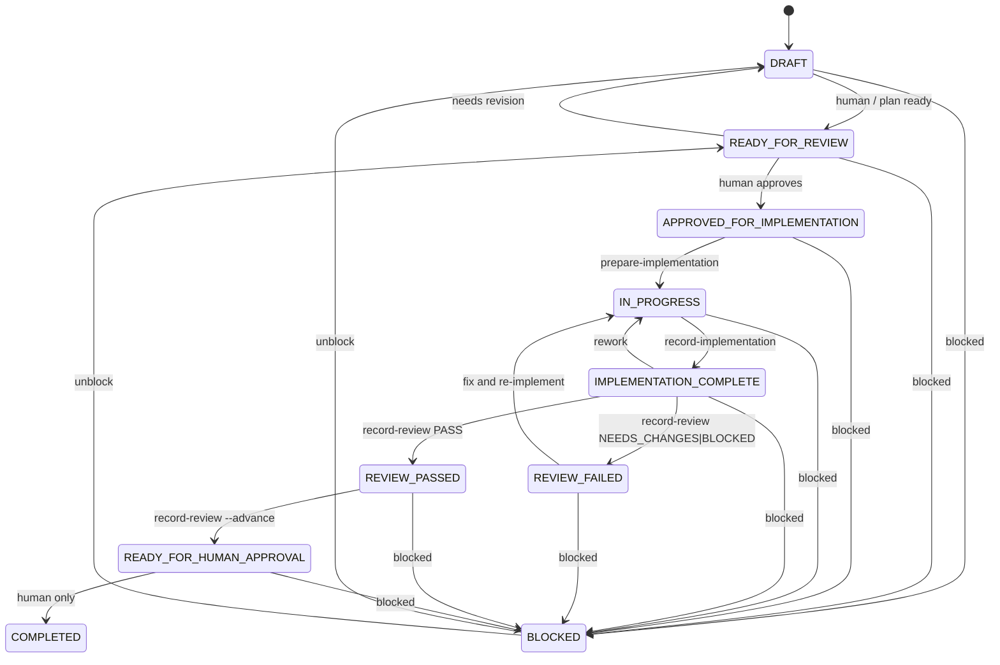

# Orchestrator state machine (V1)

## Transition guards

| From | To | Guard |
|------|-----|-------|
| DRAFT / READY_FOR_REVIEW | APPROVED_FOR_IMPLEMENTATION | **Human only** — sets STATUS in plan (+ companion) |
| APPROVED_FOR_IMPLEMENTATION | IN_PROGRESS | `confirm-approval.js` exits 0; `prepare-implementation.js` |
| IN_PROGRESS | IMPLEMENTATION_COMPLETE | `record-implementation.js` with valid results |
| IMPLEMENTATION_COMPLETE | REVIEW_PASSED / REVIEW_FAILED | `record-review.js --verdict` |
| REVIEW_PASSED | READY_FOR_HUMAN_APPROVAL | `record-review.js --advance` (**PASS only**) |
| * | COMPLETED | **Human only** — scripts refuse |
| DRAFT | IN_PROGRESS | **BLOCKED** |
| DRAFT | READY_FOR_HUMAN_APPROVAL | **BLOCKED** |
| APPROVED_FOR_IMPLEMENTATION | REVIEW_PASSED | **BLOCKED** |
| IMPLEMENTATION_COMPLETE | READY_FOR_HUMAN_APPROVAL | **BLOCKED** without REVIEW_PASSED |
| REVIEW_FAILED | READY_FOR_HUMAN_APPROVAL | **BLOCKED** |

## CLI reference

| Script | Purpose |
|--------|---------|
| `validate-plan.js` | Structure + sections + companion integrity |
| `confirm-approval.js` | APPROVED_FOR_IMPLEMENTATION gate |
| `prepare-implementation.js` | Emit impl payload; → IN_PROGRESS |
| `record-implementation.js` | → IMPLEMENTATION_COMPLETE |
| `prepare-review.js` | Emit review payload (status stays IMPLEMENTATION_COMPLETE) |
| `record-review.js` | Record PASS / NEEDS_CHANGES / BLOCKED; optional `--advance` |
| `human-summary.js` | Human merge/deploy summary (no COMPLETED write) |

## Human-only transitions

- → `APPROVED_FOR_IMPLEMENTATION`
- → `COMPLETED`
- Merge to `main` and production deploy

Automations must never perform these. Scripts refuse to write human-only statuses.
