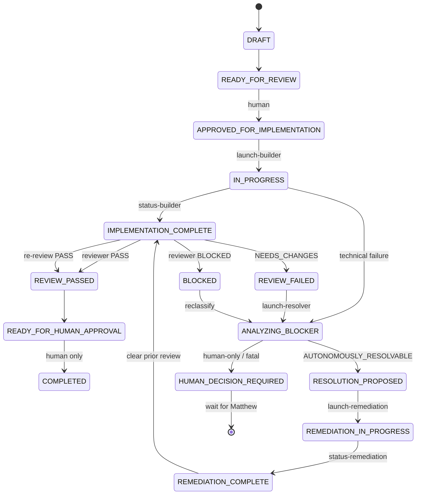

# Orchestrator state machine (V1 + autonomous remediation)

## Human-only

- → `APPROVED_FOR_IMPLEMENTATION`
- → `COMPLETED`
- Merge to `main`
- Production deploy
- Answering `HUMAN_DECISION_REQUIRED` (no automatic assumption)

## CLI

| Command | Role |
|---------|------|
| `orchestrator:launch` / `status` | Builder |
| `orchestrator:launch-reviewer` / `status-reviewer` | Reviewer |
| `orchestrator:resolve` / `status-resolver` | Resolver |
| `orchestrator:remediate` / `status-remediation` | Remediation builder |
| `orchestrator:run` / `resume` | Overnight controller |
