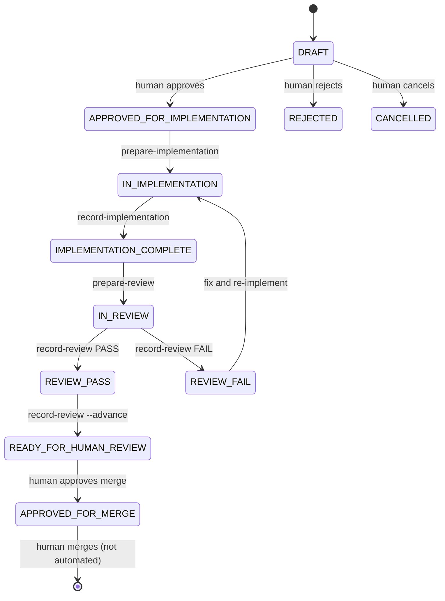

# Orchestrator state machine (V1)

## Transition guards

| From | To | Guard |
|------|-----|-------|
| DRAFT | APPROVED_FOR_IMPLEMENTATION | Human sets STATUS in plan |
| APPROVED_FOR_IMPLEMENTATION | IN_IMPLEMENTATION | `confirm-approval.js` exits 0 |
| IN_IMPLEMENTATION | IMPLEMENTATION_COMPLETE | `record-implementation.js` |
| IMPLEMENTATION_COMPLETE | IN_REVIEW | `prepare-review.js` |
| IN_REVIEW | REVIEW_PASS / REVIEW_FAIL | `record-review.js --verdict` |
| REVIEW_PASS | READY_FOR_HUMAN_REVIEW | `record-review.js --advance` (PASS only) |
| * | IMPLEMENTATION (from DRAFT) | **BLOCKED** — `confirm-approval.js` fails |

## CLI reference

| Script | Purpose |
|--------|---------|
| `validate-plan.js` | Structure + sections |
| `confirm-approval.js` | APPROVED_FOR_IMPLEMENTATION gate |
| `prepare-implementation.js` | Emit impl payload; → IN_IMPLEMENTATION |
| `record-implementation.js` | → IMPLEMENTATION_COMPLETE |
| `prepare-review.js` | Emit review payload; → IN_REVIEW |
| `record-review.js` | Record PASS/FAIL; optional advance |
| `human-summary.js` | Human merge/deploy summary |

## Human-only transitions

- DRAFT → APPROVED_FOR_IMPLEMENTATION
- READY_FOR_HUMAN_REVIEW → APPROVED_FOR_MERGE
- Merge to `main` and production deploy

Automations must never perform these without explicit human action.
