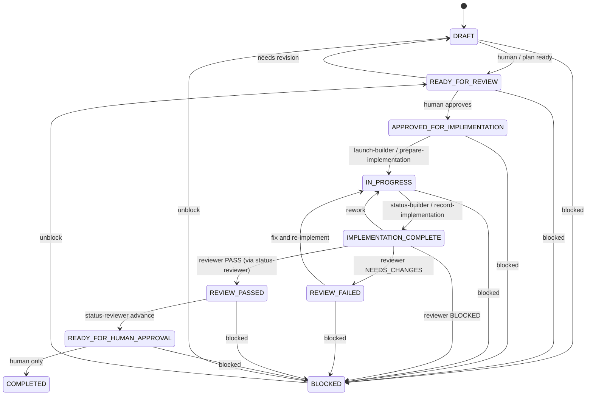

# Orchestrator state machine (V1)

## Transition guards

| From | To | Guard |
|------|-----|-------|
| DRAFT / READY_FOR_REVIEW | APPROVED_FOR_IMPLEMENTATION | **Human only** |
| APPROVED_FOR_IMPLEMENTATION | IN_PROGRESS | `launch-builder` / `prepare-implementation` after approval gate |
| IN_PROGRESS | IMPLEMENTATION_COMPLETE | Builder FINISHED + PR URL (`status-builder`) or `record-implementation` |
| IMPLEMENTATION_COMPLETE | REVIEW_PASSED → READY_FOR_HUMAN_APPROVAL | Validated Cloud reviewer `PASS` (`status-reviewer`) |
| IMPLEMENTATION_COMPLETE | REVIEW_FAILED | Validated `NEEDS_CHANGES` |
| IMPLEMENTATION_COMPLETE | BLOCKED | Validated reviewer `BLOCKED` |
| * | COMPLETED | **Human only** |
| IMPLEMENTATION_COMPLETE | READY_FOR_HUMAN_APPROVAL | **BLOCKED** without REVIEW_PASSED |

## CLI reference

| Script | Purpose |
|--------|---------|
| `validate-plan.js` | Structure + sections + companion integrity |
| `confirm-approval.js` | APPROVED_FOR_IMPLEMENTATION gate |
| `launch-builder.js` | Cursor builder create → IN_PROGRESS |
| `status-builder.js` | Poll builder; may → IMPLEMENTATION_COMPLETE |
| `launch-reviewer.js` | Separate Cursor reviewer (status stays IMPLEMENTATION_COMPLETE) |
| `status-reviewer.js` | Poll reviewer; ingest validated result; advance |
| `prepare-review.js` / `record-review.js` | Local/manual review helpers |
| `human-summary.js` | Human approval packet (no COMPLETED write) |

## Human-only transitions

- → `APPROVED_FOR_IMPLEMENTATION`
- → `COMPLETED`
- Merge to `main` and production deploy

Automations must never perform these. Scripts refuse to write human-only statuses.
