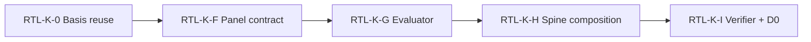

# Phase RTL-6 — Retail Wave 2 Build Specification

**Spec authored:** 2026-06-23  
**Baseline peer:** Manufacturing Wave 2 locked at `9d3afb5` (29/29 verifier PASS)  
**Upstream authority:** [`Retail_Vertical_Planning_Doc.md`](../wave1/Retail_Vertical_Planning_Doc.md), [`docs/manufacturing/wave2/`](../manufacturing/wave2/) (structural peer)

**FOUNDER APPROVED** at `1531c38` (v1.2 cross-blend PC additions). Sub-spec authoring may begin; Wave 2 code remains blocked until sub-specs land.

---

## 0. Mission

Wave 2 delivers the retail knowledge stack **runtime layer**: reporting-basis reuse (RTL-K-0 additive), Retail Performance Panel contract, KPI evaluator, spine composition binding, and verifier with D0 proof — all **additive**, with **no Phase 42 file edits**.

**Wave 2 modules:** RTL-K-0 → RTL-K-F → RTL-K-G → RTL-K-H → RTL-K-I  
**Wave 3 (out of scope):** RTL-K-J (D0 panel probe), RTL-K-K (founder lock)

---

## 1. Prerequisites

| Gate | Status |
|---|---|
| Wave 1 RTL-K-A..E | Pending (blocking Wave 2 execution) |
| Manufacturing Wave 2 lock | `9d3afb5` — D0 schema normative reference |
| `ReportingBasis` + `basisOf()` | Exists from MFG-K-0 — retail reuses |
| Phase 42 lock | ALL CLEAR (same rule as manufacturing) |
| Planning doc | [`Retail_Vertical_Planning_Doc.md`](../wave1/Retail_Vertical_Planning_Doc.md) |

---

## 2. Provenance and changelog

| Version | Date | Change |
|---|---|---|
| RTL-6 v1.0 (draft) | 2026-06-23 | Initial build spec; proposed `phase` / `verifiedAt` / `checks[]` D0 schema |
| RTL-6 v1.1 | 2026-06-23 | **Merged MFG-parity D0 schema** — supersedes v1.0 §3/§5 field names only |
| **RTL-6 v1.2 (this document)** | 2026-06-23 | Founder approval at `1531c38`; +2 cross-blend PCs (store-CGU, fiscal calendar); count 32→34; LOCK-06 → `CHK-RTL-PC-34` |

**Historical record:** [`Phase_RTL_6_v1_1_Schema_Parity_Patch.md`](./Phase_RTL_6_v1_1_Schema_Parity_Patch.md) documents *why* retail D0 field names were aligned to manufacturing (`9d3afb5`). That patch is **not** a separate applied amendment; this build spec is the canonical source.

**Cross-vertical rule:** Fund accounting Wave 2 verifier must pre-bake the same shared D0 field set documented in §3 and §5 — no second patch cycle.

**Normative MFG reference artifact:**

`ops/compliance/manufacturing-knowledge-stack/D0_MFG_KNOWLEDGE_STACK_EVIDENCE.json` (commit `9d3afb5`)

---

## 3. D0 Evidence Schema (normative)

RTL-K-I writes on **every** verifier invocation (pass or fail):

**Path:** `ops/compliance/retail-knowledge-stack/D0_RTL_KNOWLEDGE_STACK_EVIDENCE.json`

### 3.1 — Top-level required keys (mirror MFG exactly)

These six keys **must** appear with the same names as manufacturing D0. Values are retail-specific; field names are not.

| Field | Type | Retail value / rule |
|---|---|---|
| `evidenceVersion` | string | **`'RTL-K-I-1'`** — NOT `phase` |
| `generatedAt` | string | ISO-8601 timestamp — NOT `verifiedAt` |
| `totalCases` | number | **`34`** at full enumeration — NOT `totalChecks` |
| `passCount` | number | Count of cases with `outcome: 'PASS'` |
| `failCount` | number | Count of cases with `outcome: 'FAIL'` |
| `cases` | array | `VerifierCaseResult[]` — NOT `checks` |

**Invariant:** `passCount + failCount === totalCases`. `totalCases === 34` when all PCs enumerated in §6 are active.

### 3.2 — Retail-only additive top-level keys (permitted)

These keys are **not** in manufacturing D0 but are **allowed** extensions:

| Field | Type | Description |
|---|---|---|
| `commitHash` | string | Git HEAD at verifier run time |
| `registerHash` | string | SHA-256 of `Retail_Citation_Verification_Register.xlsx` |
| `waveOneDocsHashes` | object | `{ [filename: string]: sha256 }` for `docs/retail/wave1/*` |

PC-RTL-VERIFY-LOCK-06 (§6) asserts manufacturing shared keys are present; it does **not** forbid these extensions.

### 3.3 — TypeScript interface (serialization target)

```typescript
/**
 * D0 evidence schema — shared field names match manufacturing Wave 2 lock (9d3afb5).
 * Retail extensions: commitHash, registerHash, waveOneDocsHashes.
 */
interface D0Evidence {
  evidenceVersion: "RTL-K-I-1";
  generatedAt: string;
  commitHash: string;
  totalCases: number;
  passCount: number;
  failCount: number;
  cases: VerifierCaseResult[];
  registerHash: string;
  waveOneDocsHashes: { [filename: string]: string };
}
```

### 3.4 — Verifier architecture (serialization only)

Internal `VerifierCheck` / `VerifierResult` runtime types may use any naming. **Only the final JSON write** must conform to §3 and §5.

```typescript
function emitD0Evidence(results: VerifierResult[]): D0Evidence {
  return {
    evidenceVersion: "RTL-K-I-1",
    generatedAt: new Date().toISOString(),
    commitHash: readCurrentCommitHash(),
    totalCases: results.length,
    passCount: results.filter((r) => r.passed).length,
    failCount: results.filter((r) => !r.passed).length,
    cases: results.map(serializeCaseToMfgParitySchema),
    registerHash: sha256OfFile("docs/retail/wave1/Retail_Citation_Verification_Register.xlsx"),
    waveOneDocsHashes: hashWaveOneRetailDocs(),
  };
}
```

**Write discipline:**

- Create `ops/compliance/retail-knowledge-stack/` if missing
- Atomic write: `.tmp` then rename
- Exit **0** only when `failCount === 0` **and** D0 file exists post-write
- Exit **1** on any failure or D0 write failure
- No uncaught throws; failures route through `cases[]`

**Script:** `scripts/verify-retail-knowledge-stack.js`  
**npm script:** `verify:retail-knowledge-stack` (additive in `package.json`)

---

## 4. Module sequence

| Module | Deliverable | Code? |
|---|---|---|
| RTL-K-0 | `RetailBasisContracts.ts`, `RetailPanelContext`, reuse `ReportingBasis` | Yes (additive) |
| RTL-K-F | `RTL_K_F_Panel_Field_Contract_Spec.md` + `lib/dashboard/panels/retail-performance/contract.ts` | Spec then interfaces |
| RTL-K-G | `RTL_K_G_Performance_Evaluator_Spec.md` + pure functions | Spec then build |
| RTL-K-H | `RTL_K_H_Spine_Composition_Spec.md` + composition binding | Spec then build |
| RTL-K-I | `verify-retail-knowledge-stack.js` + D0 JSON | Yes |



---

## 5. Per-Case Object Shape (normative)

Each element of `cases[]` **must** use exactly these five keys — verified against manufacturing D0 at `9d3afb5`. **No additions. No substitutions.**

| Field | Type | Rule |
|---|---|---|
| `id` | string | Format **`CHK-RTL-PC-NN`** (zero-padded two digits, e.g. `CHK-RTL-PC-01` … `CHK-RTL-PC-34`) |
| `decision` | `"ALLOW" \| "DENY"` | Actual routing decision exercised by the check |
| `expected` | `"ALLOW" \| "DENY"` | Spec expectation from §6 |
| `outcome` | `"PASS" \| "FAIL"` | `PASS` iff `decision` matches `expected` |
| `reason` | string | snake_case slug (e.g. `contract_kpi_rtl_k01`, `schema_parity_verified`) |

**Prohibited per-case field names:** `caseId`, `status`, `evidence`, `failureDetail`, `category`, `priority`, `description` — these do not appear in manufacturing D0.

### 5.1 — Example case object

```json
{
  "id": "CHK-RTL-PC-01",
  "decision": "ALLOW",
  "expected": "ALLOW",
  "outcome": "PASS",
  "reason": "contract_kpi_rtl_k01"
}
```

### 5.2 — TypeScript interface

```typescript
interface VerifierCaseResult {
  id: string; // CHK-RTL-PC-NN
  decision: "ALLOW" | "DENY";
  expected: "ALLOW" | "DENY";
  outcome: "PASS" | "FAIL";
  reason: string;
}

function serializeCaseToMfgParitySchema(result: VerifierResult): VerifierCaseResult {
  return {
    id: result.id,
    decision: result.decision,
    expected: result.expected,
    outcome: result.passed ? "PASS" : "FAIL",
    reason: result.reasonSlug,
  };
}
```

---

## 6. CHK-RTL PC enumeration (34 cases)

**Count:** 34 PC cases (floor ≥ 20). Includes **PC-RTL-VERIFY-LOCK-06** as `CHK-RTL-PC-34`.

| PC ID | Category | Expected | Description |
|---|---|---|---|
| CHK-RTL-PC-01 | Contract↔KPI | ALLOW | RTL-K-01 (`sameStoreSalesGrowth`) panel field maps to KPI doc ID |
| CHK-RTL-PC-02 | Contract↔KPI | ALLOW | RTL-K-16 (`digitalCAC`) panel field maps to KPI doc ID |
| CHK-RTL-PC-03 | Contract↔KPI | ALLOW | RTL-FV-01 forecast field maps to KPI doc ID |
| CHK-RTL-PC-04 | Formula parity | ALLOW | RTL-K-01 evaluator formula matches KPI source text |
| CHK-RTL-PC-05 | Formula parity | ALLOW | RTL-K-03 (`conversionRate`) formula matches KPI |
| CHK-RTL-PC-06 | Formula parity | ALLOW | RTL-K-06 (`grossMarginPercent`) formula matches KPI |
| CHK-RTL-PC-07 | Formula parity | ALLOW | RTL-K-07 (`GMROI`) formula matches KPI |
| CHK-RTL-PC-08 | Formula parity | ALLOW | RTL-K-08 (`inventoryTurnover`) formula matches KPI |
| CHK-RTL-PC-09 | Formula parity | ALLOW | RTL-K-10 (`shrinkRate`) formula matches KPI |
| CHK-RTL-PC-10 | Formula parity | ALLOW | RTL-K-04 (`averageOrderValue`) formula matches KPI |
| CHK-RTL-PC-11 | Formula parity | ALLOW | RTL-FV-01 forecast formula mirrors RTL-K-01 |
| CHK-RTL-PC-12 | Citation register | ALLOW | Register row exists for primary NRF SSS citation |
| CHK-RTL-PC-13 | Citation register | ALLOW | Register row exists for IAS 2 LIFO prohibition citation |
| CHK-RTL-PC-14 | Sub-segment matrix | ALLOW | No blank applicability cells for RTL-K-01..16 (B/E/O/G/S). *Wave 3 (RTL-K-J): per-cell value assertions deferred to D0 panel probe.* |
| CHK-RTL-PC-15 | Overlay absence | ALLOW | No cannabis overlay import in retail lane |
| CHK-RTL-PC-16 | Overlay absence | ALLOW | No firearms/ATF overlay import in retail lane |
| CHK-RTL-PC-17 | Overlay absence | ALLOW | No `ops/compliance/overlays` import in retail lane |
| CHK-RTL-PC-18 | Spine import | ALLOW | Composition module imports spine public barrel only |
| CHK-RTL-PC-19 | Spine import | DENY | Composition must not import overlay namespace |
| CHK-RTL-PC-20 | ReportingBasis | ALLOW | `basisOf('ifrs_eu')` === `basisOf('ifrs_iasb')` === `'IFRS'` |
| CHK-RTL-PC-21 | Type isolation | ALLOW | `IFRSGiftCardLiability` union excludes US-only breakage fields |
| CHK-RTL-PC-22 | Lease guard | ALLOW | Lease observation branches via `basisOf()` — bi-directional reclassification |
| CHK-RTL-PC-23 | Phase 42 lock | ALLOW | Retail verifier does not import locked Phase 42 healthcare builders |
| CHK-RTL-PC-24 | D0 artifact | ALLOW | D0 JSON written to `ops/compliance/retail-knowledge-stack/` on every run |
| CHK-RTL-PC-25 | Panel context | ALLOW | `RetailPanelContext` exported with required fields |
| CHK-RTL-PC-26 | CC guard | ALLOW | `applicableBasis` present on Command Center surface candidate input |
| CHK-RTL-PC-27 | Spine barrel | ALLOW | `lib/intelligence/synthetic/spine/index.ts` re-exports only |
| CHK-RTL-PC-28 | ASC 606 surface | ALLOW | Returns reserve logic cites ASC 606-10-32-10 (not ASC 605) |
| CHK-RTL-PC-29 | RIM routing | ALLOW | RIM/LCM path gated to US_GAAP inventory branch only |
| CHK-RTL-PC-30 | Gift card routing | ALLOW | Gift card breakage branches via `USGAAPGiftCardLiability` / `IFRSGiftCardLiability` |
| CHK-RTL-PC-31 | Loyalty routing | ALLOW | Loyalty material-right treatment uses shared interface; basis on disclosure only |
| CHK-RTL-PC-32 | Cross-blend trap | ALLOW | Store-CGU impairment routing: `IFRSStoreCGU` reached only when `basisOf() === 'IFRS'`; `ASC360StoreImpairment` reached only on US_GAAP trigger path. Reason slug: `store_cgu_basis_routed` |
| CHK-RTL-PC-33 | Cross-blend trap | ALLOW | Fiscal calendar routing: `fiscalCalendar === '4-5-4'` uses NRF week boundaries, `'calendar'` uses ISO month boundaries; same-store comparison enforces matching boundary type on both periods. Reason slug: `fiscal_calendar_routed` |
| CHK-RTL-PC-34 | **Schema parity** | ALLOW | **PC-RTL-VERIFY-LOCK-06:** shared D0 keys match MFG-K-I (`9d3afb5`) |

### 6.1 — PC-RTL-VERIFY-LOCK-06 (CHK-RTL-PC-34) — implementation

**Priority:** HIGH

**Description:** At verifier startup, load `ops/compliance/manufacturing-knowledge-stack/D0_MFG_KNOWLEDGE_STACK_EVIDENCE.json`. Extract:

1. Required shared top-level keys: `evidenceVersion`, `generatedAt`, `totalCases`, `passCount`, `failCount`, `cases`
2. Per-case keys from `cases[0]`: `id`, `decision`, `expected`, `outcome`, `reason`

After RTL D0 emission, assert retail JSON contains **every** shared key with matching per-case key set.

**Failure conditions:**

- Any shared top-level MFG key missing from retail D0
- Any per-case MFG key missing from retail `cases[]` objects
- Retail per-case objects contain keys not in the MFG allowlist (`id`, `decision`, `expected`, `outcome`, `reason`)

**Pass reason slug:** `schema_parity_verified`

**If MFG D0 unreadable at build time:** CRITICAL FLAG — do not bypass; verifier exits non-zero.

---

## 7. Planning-doc checks (a)–(f)

| Check | Description |
|---|---|
| (a) | Every panel contract field maps to a KPI ID in `Retail_KPIs_Sources.md` |
| (b) | Evaluator formulas match KPI source verbatim (whitespace-normalized) |
| (c) | Citation register rows fetched; HIGH-priority drift → `CITATION_DRIFT_<register_id>` |
| (d) | Sub-segment applicability matrix (B/E/O/G/S) has no blank cells per KPI |
| (e) | No prohibited overlay imports in `lib/intelligence/synthetic/industry/retail/` |
| (f) | Spine composition imports from `lib/intelligence/synthetic/spine/` barrel only |

---

## 8. RTL-K-F / G / H summary (deferred detail to sub-specs)

### RTL-K-F — Panel contract

- **Path:** `lib/dashboard/panels/retail-performance/contract.ts`
- **Panel:** Retail Performance Panel (operations + merchandising combined)
- **Realized fields:** RTL-K-01..16; forecast: RTL-FV-01..16
- **Context:** `RetailPanelContext` with `subSegment: 'B' | 'E' | 'O' | 'G' | 'S'`
- **Sign convention:** Same as manufacturing (F = favorable negative; U = unfavorable positive) where dollar variances apply; percentage KPIs carry unit metadata

### RTL-K-G — Performance evaluator

- **Path:** `lib/intelligence/synthetic/industry/retail/performance/`
- Pure functions; basis routing via `RetailBasisContracts` + `basisOf()`
- RIM/LIFO/gift-card/loyalty cross-blend guards per planning doc §8

### RTL-K-H — Spine composition

- **Path:** `lib/intelligence/synthetic/industry/retail/composition/`
- Same spine discipline as MFG-K-H: public barrel imports only, authorization before read, explicit `reportingFramework`

---

## 9. Definition of Done

Wave 2 RTL lane is **build-complete** when:

- ✅ RTL-K-0 through RTL-K-I delivered per §4
- ✅ `npm run verify:retail-knowledge-stack` exits **0**
- ✅ **34/34 PASS** (`passCount === 34`, `failCount === 0`, `totalCases === 34`)
- ✅ D0 shared top-level fields match manufacturing: `evidenceVersion`, `generatedAt`, `totalCases`, `passCount`, `failCount`, `cases`
- ✅ Per-case keys exactly: `id`, `decision`, `expected`, `outcome`, `reason`
- ✅ Retail extensions present: `commitHash`, `registerHash`, `waveOneDocsHashes`
- ✅ **CHK-RTL-PC-34 / PC-RTL-VERIFY-LOCK-06 PASS**
- ✅ Phase 42 healthcare paths untouched post-`b11adcd`
- ✅ No `panels/registry.ts` edits

---

## 10. Hard rules

1. **No edits** to Phase 42 locked healthcare industry paths.
2. **Additive only** on spine touchpoints.
3. **No** `panels/registry.ts`.
4. **No** Supabase migrations in Wave 2.
5. **No** cannabis / firearms overlay code in Wave 2.
6. **Lease guard:** `basisOf()` only (reuse MFG-K-0 pattern).
7. **D0 schema parity** with manufacturing shared fields (§3, §5, §6) — do not invent vertical-specific JSON field names.
8. **Do not emit** deprecated fields (`phase`, `verifiedAt`, `totalChecks`, `passedChecks`, `failedChecks`, `checks`).
9. **Do not emit** both old and new field names.
10. **Spec before build** for F/G/H/I sub-specs (same Option A pattern as manufacturing).

---

## 11. Anti-patterns

- ❌ Inventing D0 field names per vertical — use §3 shared keys
- ❌ Per-case objects with `caseId` / `status` / `evidence` / `failureDetail`
- ❌ Skipping PC-RTL-VERIFY-LOCK-06 when MFG D0 is present
- ❌ Deep-importing `ops/control-spine/<internal>/...` from composition
- ❌ Importing Phase 42 healthcare builders from retail lane
- ❌ Verifier exit 0 without fresh D0 write

---

**END — Phase RTL-6 Retail Wave 2 Build Specification (v1.2 founder-approved)**
