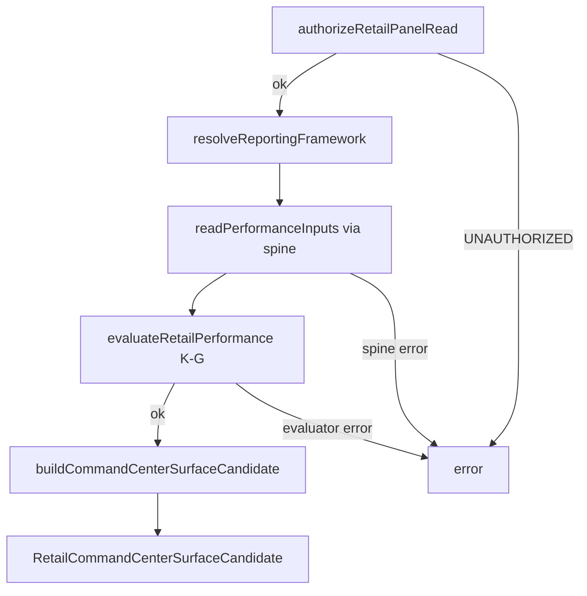

# RTL-K-H — Spine Composition Sub-Spec

**Module:** RTL-K-H — Retail Spine Composition  
**Baseline:** `c55a33b` (RTL-K-G performance evaluator)  
**Authority:** [`Phase_RTL_6_Build_Spec.md`](../Phase_RTL_6_Build_Spec.md) at commit **`2e7f67f`** (§8 RTL-K-H summary, §6 PCs 15–19/23/25–27), [`RTL_K_G_Performance_Evaluator_Spec.md`](./RTL_K_G_Performance_Evaluator_Spec.md), [`RTL_K_F_Panel_Contract_Spec.md`](./RTL_K_F_Panel_Contract_Spec.md), [`RTL_K_0_Basis_Contracts_Spec.md`](./RTL_K_0_Basis_Contracts_Spec.md)

**DRAFT / SPEC ONLY — NOT EXECUTABLE** as a deployed panel path. Composition binds K-G evaluator to spine isolation helpers.

---

## 1. Purpose

Compose the RTL-K-G performance evaluator with the spine isolation layer to produce a Command Center surface candidate for the Retail Performance Panel.

- Spine reads supply raw inputs (net sales, traffic/sessions, inventory basis objects, gift-card/loyalty/returns objects, optional forecast feeds, lease observation inputs)
- K-G evaluator transforms inputs into `RetailPerformancePanelContract`
- Composition emits a `CommandCenterSurfaceCandidate` wrapping the panel payload and CC surface metadata
- **No spine reimplementation** — imports spine isolation helpers from the public consumption barrel only

**Path:** `lib/intelligence/synthetic/industry/retail/composition/`

---

## 2. Module layout

| File | Responsibility |
|---|---|
| `types.ts` | `RetailSpineDependencies`, `RetailSpineSession`, `RetailCommandCenterSurfaceCandidate` |
| `resolveReportingFramework.ts` | `ReportingBasis` → `StandardsReportingFramework` (J-02 peer) |
| `resolveForecastInputSource.ts` | Tenant-config forecast feed selection (`demand-forecast`, `open-to-buy`, `merchandise-plan`, `sop`) |
| `authorizeRetailPanelRead.ts` | Authorization gate before any read |
| `composeRetailPerformancePanel.ts` | Main orchestrator |
| `createRetailSpineDependencies.ts` | Default DI wiring factory |
| `index.ts` | Re-exports |

Public spine consumption barrel (existing): `lib/intelligence/synthetic/spine/index.ts` — re-exports Phase 42.5B/C/P helpers from `ops/control-spine/*/index.ts` public barrels only.

---

## 3. Composition signature

```typescript
import type { RetailPerformancePanelReadParams } from "../../../../dashboard/panels/retail-performance/contract";
import type { RetailEvaluatorResult } from "../performance/types";

export function composeRetailPerformancePanel(
  params: RetailPerformancePanelReadParams,
  spineDependencies: RetailSpineDependencies,
): Promise<RetailEvaluatorResult<RetailCommandCenterSurfaceCandidate>>;
```

| Param | Type | Source |
|---|---|---|
| `params` | `RetailPerformancePanelReadParams` | K-F contract (`companyId`, `accountingPeriod`, `context`) |
| `spineDependencies` | `RetailSpineDependencies` | DI-style spine helper + read bindings (testable without spine fixtures) |

Returns a `Promise` (spine reads are async) wrapping the K-G `RetailEvaluatorResult` type extended with composition error codes.

---

## 4. Spine isolation imports (Phase 42 lock discipline)

**Rule (verbatim):** Composition module imports spine isolation helpers from their **public export barrels only**. Direct imports from `lib/intelligence/synthetic/spine/<internal>/...` are prohibited. If a needed helper is not exported, expand the spine export surface (separate spine ticket) — do not deep-import.

### Public consumption barrel

`lib/intelligence/synthetic/spine/index.ts` re-exports from `ops/control-spine` public barrels only:

| Export barrel | Helpers consumed by retail composition |
|---|---|
| `ops/control-spine/isolation/index.ts` | `classifyIsolationReach`, `evaluateIsolationBoundary`, `ClassifyIsolationReachInput`, `ControlSpineIsolationScope` |
| `ops/control-spine/rbac/index.ts` | `evaluateRbacAccess`, `EvaluateRbacAccessInput` |
| `ops/control-spine/verification/panel-data-paths/index.ts` | `panelDataPathHarness`, `buildIsolationScopeFromTenantId`, `PanelDataPathHarness` |

### Prohibited import paths

- `ops/control-spine/isolation/evaluateIsolationBoundary.ts` (internal deep path)
- `ops/compliance/overlays/**` (overlay namespace — CHK-RTL-PC-17 DENY)
- `lib/intelligence/synthetic/industry/healthcare/**` (Phase 42 lock — CHK-RTL-PC-23)
- Any `lib/intelligence/synthetic/spine/<internal>/...` deep path

**PC bindings:** CHK-RTL-PC-18 (ALLOW spine public barrel), CHK-RTL-PC-19 (DENY overlay namespace), CHK-RTL-PC-27 (spine barrel re-exports only).

---

## 5. Cross-tenant / persona refusal

`authorizeRetailPanelRead` runs **before any data read**:

1. Cross-tenant guard: `params.companyId` and `params.context.companyId` must match `session.tenantId`
2. RBAC + isolation composition via `evaluateRbacAccess` with `isolationInput`
3. Panel boundary via `panelDataPathHarness.assertTenantScope`

On unauthorized persona or cross-tenant attempt:

```typescript
return { ok: false, error: "UNAUTHORIZED" };
```

Never `throw`. Never return a partial panel.

---

## 6. `reportingFramework` resolution

`resolveReportingFramework.ts`:

| `ReportingBasis` | `StandardsReportingFramework` |
|---|---|
| `US_GAAP` | `us_gaap` |
| `IFRS` | `ifrs_iasb` (J-02 internal default) |

**Hard rule:** Composition MUST pass the resolved `reportingFramework` explicitly to every downstream call that accepts it — notably `buildLeaseIntelligenceObservation`. The lease guard's default MUST never be relied upon by composition.

Composition call site for lease guard (CHK-RTL-PC-22):

```typescript
buildLeaseObservation({
  ...leaseInput,
  reportingFramework, // explicit — never omitted
});
```

K-I verifier **CHK-RTL-PC-22** must test bi-directional reclassification:

- `US_GAAP` framework → `ifrs16_lessee_candidate` when input category is `asc842_candidate` under IFRS routing
- `IFRS` framework → `asc842_candidate` when input category is `ifrs16_lessee_candidate` under US GAAP routing

Branching uses `basisOf(reportingFramework)` only — no framework literal compares in composition code.

---

## 7. Forecast input source resolution

When forecast variance is requested, composition reads forecast inputs from spine via `readForecastInputs` callback.

Feed selection is **tenant-config driven** (`session.forecastInputSource` or tenant attribute):

| Config value | Feed |
|---|---|
| `demand-forecast` | Demand-forecast feed |
| `open-to-buy` | Open-to-buy / merchandise plan feed |
| `merchandise-plan` | Merchandise planning feed |
| `sop` | Sales & operations planning feed |

When no forecast source is configured or spine returns `null`: `forecastVarianceSection` is **undefined** in output — **not an error**.

**PC-11 scope:** CHK-RTL-PC-11 fires statically against `forecast.ts` evaluator source vs `compSales.ts` source — not against runtime panel output. Absent `forecastVarianceSection` at runtime does not vacate PC-11; the check is source-level formula parity, consistent with PC-04..10 in K-G §11.

---

## 8. `RetailCommandCenterSurfaceCandidate` shaping

```typescript
import type { ReportingBasis } from "../../../standards/contracts/ReportingBasis";
import type { RetailPerformancePanelContract } from "../../../../dashboard/panels/retail-performance/contract";

interface RetailCommandCenterSurfaceCandidate {
  surfaceCandidate: SyntheticStructuredCommandCenterSurfaceCandidate;
  payload: RetailPerformancePanelContract;
  applicableBasis: ReportingBasis;
}
```

| Field | Value |
|---|---|
| `applicableBasis` | **`params.context.applicableBasis`** — single basis for this tenant read (PC-26); equals `params.context.reportingBasis` |
| `payload` | K-G `RetailPerformancePanelContract` |
| `surfaceCandidate` | Built via `buildCommandCenterSurfaceCandidate` |

**PC-26 binding:** `applicableBasis` on the surface candidate MUST be populated from `RetailPanelContext.applicableBasis` (RTL-K-0 alias). Manufacturing uses `ReportingBasis[]` at the CC default; retail Wave 2 binds the **tenant-elected single basis** on both context and surface candidate.

Surface metadata per existing CC conventions (`buildCommandCenterSurfaceCandidate.ts`):

| Field | Retail value |
|---|---|
| `surfaceArtifactCategory` | `industry_item` |
| `surfacePlacement` | `primary_surface` |
| `consumptionChannels` | `company_surface`, `executive_summary` |
| `decisionSurfaceCategory` | `monitoring` |
| `surfaceCategory` | `controller_command` |
| `visibleRoleCategories` | `controller`, `cfo`, `operations` (CC convention per MFG-K-H §8), plus `merchandising` (retail panel scope — [`Retail_Vertical_Planning_Doc.md`](../../wave1/Retail_Vertical_Planning_Doc.md) §4: operations + merchandising combined) |
| `applicableBasis` | From `context.applicableBasis` (not hard-coded array) |

---

## 9. `RetailSpineDependencies` (DI interface)

```typescript
interface RetailSpineDependencies {
  session: RetailSpineSession;
  authorizePanelRead: AuthorizeRetailPanelRead;
  readPerformanceInputs: ReadRetailPerformanceInputs;
  readForecastInputs?: ReadRetailForecastInputs;
  readLeaseObservationInput?: ReadLeaseObservationInput;
  buildPrioritizationPackage: BuildRetailPrioritizationPackage;
  buildLeaseObservation?: BuildLeaseObservation;
}
```

- `readPerformanceInputs` maps spine reads to K-G `RetailEvaluatorInputs` (inventory discriminated union preserves CHK-RTL-PC-21/29)
- Must populate optional cross-blend objects when spine data exists: `giftCard`, `loyalty`, `returnsReserve` (required when returns rate > 0 per K-G §6.4), `storeImpairment`
- `buildPrioritizationPackage` supplies the prioritization package required by `buildCommandCenterSurfaceCandidate`
- Optional spine helper overrides for test injection

### `RetailSpineSession` (minimum fields)

```typescript
interface RetailSpineSession {
  tenantId: string;
  personaId: string;
  reportingBasis: ReportingBasis;
  subSegment: RetailSubSegment;
  fiscalCalendar: RetailFiscalCalendar;
  forecastInputSource?: string;
}
```

Composition constructs `RetailPanelContext` from session + params, ensuring `applicableBasis === reportingBasis`.

---

## 10. Composition orchestration flow



1. **Authorize** — refuse cross-tenant / unauthorized persona
2. **Resolve framework** — `ReportingBasis` → `StandardsReportingFramework`
3. **Read** — spine supplies `RetailEvaluatorInputs` including `compPeriodPair` for fiscal calendar (PC-33)
4. **Evaluate** — pure K-G `evaluate()` — no spine I/O inside evaluator
5. **Emit** — wrap in `CommandCenterSurfaceCandidate` with `applicableBasis` from context

---

## 11. IFRS divergence (composition touchpoints)

| Touchpoint | US GAAP path | IFRS path | Composition duty |
|---|---|---|---|
| Inventory read | May include `USGAAPRIMInventory` | `RetailIFRSInventory` only | Spine read must not attach LIFO layers on IFRS branch |
| Returns reserve read | Gross `USGAAPRefundLiability` + `USGAAPReturnAsset` | Gross IFRS 15 pair | Required when returns rate > 0 (K-G Pattern B) |
| Lease observation | ASC 842 via `basisOf() === 'US_GAAP'` | IFRS 16 via IFRS branch | Explicit `reportingFramework` on every lease call |
| Store impairment | `ASC360StoreImpairment` object | `IFRSStoreCGU` object | Basis-discriminated spine payload |
| Gift card / loyalty | US types with escheat overlay | IFRS types without escheat | Pass through unchanged; K-G routes |

---

## 12. Error handling

Extends K-G `RetailEvaluatorError`:

| Code | When |
|---|---|
| `UNAUTHORIZED` | Cross-tenant or persona denial before read |
| `SPINE_READ_FAILED` | Spine callback returned irrecoverable error |
| `SURFACE_CANDIDATE_BUILD_FAILED` | `buildCommandCenterSurfaceCandidate` skipped or failed |

All K-G codes remain valid. Never `throw`.

---

## 13. CHK-RTL mapping for K-I

| Check | Expected | Description |
|---|---|---|
| CHK-RTL-PC-15 | ALLOW | No cannabis overlay import in retail lane |
| CHK-RTL-PC-16 | ALLOW | No firearms/ATF overlay import in retail lane |
| CHK-RTL-PC-17 | ALLOW | No `ops/compliance/overlays` import in retail lane |
| CHK-RTL-PC-18 | ALLOW | Composition imports from spine public barrel only |
| CHK-RTL-PC-19 | DENY | Composition must not import overlay namespace |
| CHK-RTL-PC-23 | ALLOW | Composition must not import locked Phase 42 healthcare builders |
| CHK-RTL-PC-25 | ALLOW | `RetailPanelContext` exported and populated on read |
| CHK-RTL-PC-26 | ALLOW | `applicableBasis` present on surface candidate (from context) |
| CHK-RTL-PC-27 | ALLOW | `lib/intelligence/synthetic/spine/index.ts` re-exports only |

Overlay absence checks (PC-15..17) are static import scans; spine import checks (PC-18/19/27) are static + composition module graph scans.

---

## 14. Definition of done (RTL-K-H sub-spec → build)

| # | Criterion |
|---|---|
| 1 | All modules in §2 exist under `lib/intelligence/synthetic/industry/retail/composition/` |
| 2 | `composeRetailPerformancePanel` returns `RetailCommandCenterSurfaceCandidate` on success |
| 3 | Authorization before read; no partial panels on denial |
| 4 | Spine imports from public barrel only; no overlay / healthcare imports |
| 5 | `applicableBasis` on surface candidate equals `context.applicableBasis` |
| 6 | `npx tsc --noEmit` clean after build |

---

## 15. Non-goals

- No spine logic reimplementation
- No Supabase migration
- No `panels/registry.ts` modification
- No Command Center router edits beyond K-0 `applicableBasis` field
- No `app/upload/page.tsx` changes
- No Phase 42 healthcare file edits
- No cannabis / firearms overlay code
- No evaluator formula changes (RTL-K-G owns math)
- No verifier / D0 (RTL-K-I)

---

**END — RTL-K-H Spine Composition Sub-Spec (founder-approved)**
